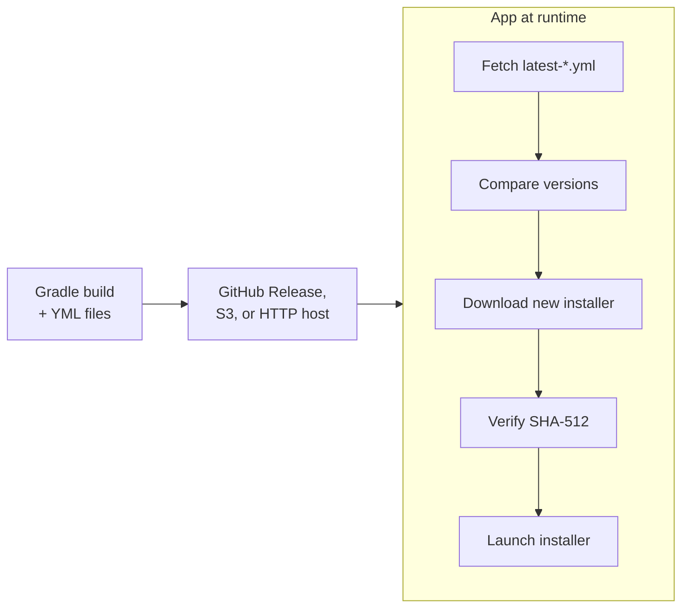

# Auto Update

Potassium provides a complete auto-update solution compatible with the [electron-builder update format](https://www.electron.build/auto-update). The system has two parts:

1. **Build-time**: The plugin generates update metadata files (`latest-*.yml`) alongside your installers
2. **Runtime**: The `potassium.updater-runtime` library checks for updates, downloads, and installs them

## How It Works



!!! tip "Try it yourself"
    Download an **older version** of the Potassium demo app from the [GitHub Releases page](https://github.com/kdroidFilter/Nucleus/releases), install it, and launch it. The app will automatically detect that a newer version is available, download the update with a progress bar, and offer an "Install & Restart" button. This is the exact same flow your users will experience.

## Updatable Formats

| Platform | Updatable Formats | Not updatable (Store-managed) |
|----------|-------------------|-------------------------------|
| macOS | DMG, ZIP | PKG |
| Windows | EXE/NSIS, NSIS Web, MSI | AppX/MSIX |
| Linux | DEB, RPM, AppImage | Snap, Flatpak |

PKG (macOS), AppX/MSIX (Windows), Snap, and Flatpak are not supported by the auto-updater because Potassium assumes these formats are distributed through their respective app stores (Mac App Store, Microsoft Store, Snapcraft, Flathub), which handle updates natively.

!!! warning "macOS: ZIP is required alongside DMG"
    On macOS, the auto-updater uses the **ZIP** format to perform the update (extract and replace the `.app` bundle silently). The DMG is used for initial installation only. You **must** include `MacOSTargetFormat.Zip` in your macOS `targetFormats` configuration, otherwise macOS auto-update will not work:

    ```kotlin
    macOS {
        targetFormats(
            MacOSTargetFormat.Dmg,   // Initial install
            MacOSTargetFormat.Zip,   // Required for auto-update on macOS
            // ... other formats
        )
    }
    ```

    Both the DMG and ZIP artifacts must be uploaded to the same release (GitHub, S3, or HTTP server). The generated `latest-mac.yml` will reference both files.

## Update Metadata (YML Files)

The auto-updater relies on three YAML files that list all available installers with their SHA-512 checksums. These files **must be generated after building on all platforms**, because each platform produces its own artifacts.

### How CI generates them

In the release workflow, each platform builds its installers in parallel and uploads them as separate artifacts (`release-assets-macOS-arm64`, `release-assets-Linux-amd64`, etc.). A final `release` job then:

1. Downloads all platform artifacts into a single directory
2. Runs the `generate-update-yml` action, which scans every installer file, computes SHA-512 checksums, and produces `latest-mac.yml`, `latest.yml` (Windows), and `latest-linux.yml`
3. Uploads everything (installers + YML files) to the release

See the [example release workflow](https://github.com/kdroidFilter/Nucleus/blob/main/.github/workflows/release-desktop.yaml) for the full setup.

### Building locally

The plugin already generates a `latest-*.yml` file alongside the installers when you run `packageDistributionForCurrentOS`. If you build on a single machine, the YML is ready to use for that platform.

However, for a real multi-platform release, you need to build on each platform (macOS, Windows, Linux) and then **merge** the per-platform YML files into final ones that reference all architectures. The CI does this automatically with the `generate-update-yml` action. To do it locally:

1. Build on each platform and collect all installers + YML files into a single directory
2. For each platform YML (e.g. `latest-mac.yml`), merge the `files:` entries from all architectures into one file

For example, if you built on macOS ARM64 and macOS x64 separately, combine both `files:` entries into a single `latest-mac.yml`:

```yaml
version: 1.2.3
files:
  - url: MyApp-1.2.3-macos-arm64.dmg
    sha512: <hash-from-arm64-build>
    size: 102400000
  - url: MyApp-1.2.3-macos-arm64.zip
    sha512: <hash-from-arm64-build>
    size: 98000000
  - url: MyApp-1.2.3-macos-x64.dmg
    sha512: <hash-from-x64-build>
    size: 98765432
  - url: MyApp-1.2.3-macos-x64.zip
    sha512: <hash-from-x64-build>
    size: 95000000
path: MyApp-1.2.3-macos-arm64.dmg
sha512: <hash-of-first-file>
releaseDate: '2026-03-01T12:00:00.000Z'
```

!!! tip
    In practice, always use CI for multi-platform releases. The [release workflow](https://github.com/kdroidFilter/Nucleus/blob/main/.github/workflows/release-desktop.yaml) handles all of this automatically: build in parallel, merge YML files, and publish to GitHub Releases in a single pipeline.

### YML file examples

Three YAML files are generated per release:

### `latest-mac.yml`
```yaml
version: 1.2.3
files:
  - url: MyApp-1.2.3-macos-arm64.dmg
    sha512: VkJl1gDqcBHYbYhMb0HRI...
    size: 102400000
  - url: MyApp-1.2.3-macos-amd64.dmg
    sha512: qJ8a5gFDCwv0R2rW6lM3k...
    size: 98765432
releaseDate: '2025-06-15T10:30:00.000Z'
```

### `latest.yml` (Windows)
```yaml
version: 1.2.3
files:
  - url: MyApp-1.2.3-windows-amd64.exe
    sha512: abc123...
    size: 85000000
releaseDate: '2025-06-15T10:30:00.000Z'
```

### `latest-linux.yml`
```yaml
version: 1.2.3
files:
  - url: MyApp-1.2.3-linux-amd64.deb
    sha512: def456...
    size: 68000000
  - url: MyApp-1.2.3-linux-arm64.deb
    sha512: ghi789...
    size: 65000000
releaseDate: '2025-06-15T10:30:00.000Z'
```

## Release Channels

Potassium supports three release channels. Different YML files are generated for each:

| Channel | YML Files | Tag Pattern |
|---------|-----------|-------------|
| `latest` | `latest-*.yml` | `v1.0.0` |
| `beta` | `beta-*.yml` | `v1.0.0-beta.1` |
| `alpha` | `alpha-*.yml` | `v1.0.0-alpha.1` |

The channel is auto-detected from the version tag in CI.

## Publishing Artifacts

### The `publish {}` block in `build.gradle.kts`

The `publish {}` block **only generates configuration** for electron-builder — it does **not** upload anything by itself. It tells the generated `electron-builder.yml` where the update files will be hosted, so the updater knows where to look:

```kotlin
potassium {
    publish {
        github {
            enabled = true
            owner = "myorg"
            repo = "myapp"
            channel = ReleaseChannel.Latest
            releaseType = ReleaseType.Release
        }
    }
}
```

You are responsible for uploading the installers and YML files to your chosen hosting. There are three options:

### Option 1: GitHub Releases (recommended)

The simplest approach. Use the [ready-made release CI workflow](https://github.com/kdroidFilter/Nucleus/blob/main/.github/workflows/release-desktop.yaml) which handles everything automatically:

1. Builds on all platforms in parallel
2. Generates the `latest-*.yml` files from all platform artifacts
3. Uploads everything to a GitHub Release

Push a tag (`v1.0.0`) and the workflow takes care of the rest. See [CI/CD](ci-cd.md) for setup details and [Publishing](publishing.md) for the full DSL reference.

### Option 2: Amazon S3

Configure the S3 provider and upload artifacts from your CI pipeline:

```kotlin
publish {
    s3 {
        enabled = true
        bucket = "my-updates-bucket"
        region = "us-east-1"
        path = "releases"
        acl = "public-read"
    }
}
```

### Option 3: Generic HTTP server

Host your files on any HTTP server. Upload the installers and YML files to the same base URL:

```kotlin
publish {
    generic {
        enabled = true
        url = "https://updates.example.com/releases/"
    }
}
```

The updater will fetch `https://updates.example.com/releases/latest-mac.yml` (and equivalent for other platforms) to check for updates, then download the installer from the same base URL.

See [Publishing](publishing.md) for the full configuration reference.

## Runtime Library

### Installation

```kotlin
dependencies {
    implementation("io.github.kdroidfilter:potassium.updater-runtime:1.0.0")
}
```

### Quick Start

```kotlin
import com.seanproctor.potassium.updater.PotassiumUpdater
import com.seanproctor.potassium.updater.UpdateResult
import com.seanproctor.potassium.updater.provider.GitHubProvider

val updater = PotassiumUpdater {
    provider = GitHubProvider(owner = "myorg", repo = "myapp")
}

when (val result = updater.checkForUpdates()) {
    is UpdateResult.Available -> {
        println("Update available: ${result.info.version}")

        updater.downloadUpdate(result.info).collect { progress ->
            println("${progress.percent.toInt()}%")
            if (progress.file != null) {
                updater.installAndRestart(progress.file!!)
            }
        }
    }
    is UpdateResult.NotAvailable -> println("Up to date")
    is UpdateResult.Error -> println("Error: ${result.exception.message}")
}
```

### Configuration

```kotlin
PotassiumUpdater {
    // Current app version (auto-detected from jpackage.app-version system property)
    currentVersion = "1.0.0"

    // Update source (required)
    provider = GitHubProvider(owner = "myorg", repo = "myapp")

    // Release channel: "latest", "beta", or "alpha"
    channel = "latest"

    // Allow installing older versions
    allowDowngrade = false

    // Allow pre-release versions (auto-enabled if currentVersion contains "-")
    allowPrerelease = false

    // Force a specific installer format (auto-detected if null)
    executableType = null
}
```

### Providers

#### GitHub Releases

```kotlin
import com.seanproctor.potassium.updater.provider.GitHubProvider

provider = GitHubProvider(
    owner = "myorg",
    repo = "myapp",
    token = "ghp_..."  // Optional, for private repos
)
```

#### Generic HTTP Server

```kotlin
import com.seanproctor.potassium.updater.provider.GenericProvider

provider = GenericProvider(
    baseUrl = "https://updates.example.com"
)
```

Host your YML files and installers at:
```
https://updates.example.com/latest-mac.yml
https://updates.example.com/latest.yml
https://updates.example.com/latest-linux.yml
https://updates.example.com/MyApp-1.2.3-macos-arm64.dmg
```

### API Reference

#### PotassiumUpdater

| Method | Description |
|--------|-------------|
| `isUpdateSupported(): Boolean` | Check if the current executable type supports auto-update |
| `suspend checkForUpdates(): UpdateResult` | Check for a newer version |
| `downloadUpdate(info: UpdateInfo): Flow<DownloadProgress>` | Download the installer with progress |
| `installAndRestart(installerFile: File)` | Launch the installer, exit the current process, and relaunch after install |
| `installAndQuit(installerFile: File)` | Launch the installer and exit without relaunching — the update is applied on next manual start |
| `consumeUpdateEvent(): UpdateEvent?` | Returns the post-update event if the app was just updated, then clears it. Returns `null` if no update occurred. |
| `wasJustUpdated(): Boolean` | Non-consuming check — returns `true` if the app was launched after an update. Call `consumeUpdateEvent()` to clear. |

#### DownloadProgress

```kotlin
data class DownloadProgress(
    val bytesDownloaded: Long,
    val totalBytes: Long,
    val percent: Double,       // 0.0 .. 100.0
    val file: File? = null,    // Non-null on the final emission
)
```

#### UpdateResult

```kotlin
sealed class UpdateResult {
    data class Available(val info: UpdateInfo, val level: UpdateLevel)
    data object NotAvailable
    data class Error(val exception: UpdateException)
}
```

#### UpdateLevel

```kotlin
enum class UpdateLevel {
    MAJOR,       // e.g. 1.x.x → 2.x.x
    MINOR,       // e.g. 1.2.x → 1.3.x
    PATCH,       // e.g. 1.2.3 → 1.2.4
    PRE_RELEASE, // e.g. 1.2.3-beta.1 → 1.2.3-beta.2
}
```

The `level` is computed automatically by comparing the current version with the available version using semantic versioning.

#### UpdateEvent

```kotlin
data class UpdateEvent(
    val previousVersion: String,
    val newVersion: String,
    val updateLevel: UpdateLevel,
)
```

### Compose Desktop Integration

```kotlin
@Composable
fun UpdateBanner() {
    val updater = remember {
        PotassiumUpdater {
            provider = GitHubProvider(owner = "myorg", repo = "myapp")
        }
    }

    var status by remember { mutableStateOf("Checking for updates...") }
    var progress by remember { mutableStateOf(-1.0) }
    var downloadedFile by remember { mutableStateOf<File?>(null) }

    LaunchedEffect(Unit) {
        when (val result = updater.checkForUpdates()) {
            is UpdateResult.Available -> {
                status = "Downloading v${result.info.version}..."
                updater.downloadUpdate(result.info).collect {
                    progress = it.percent
                    if (it.file != null) {
                        downloadedFile = it.file
                        status = "Ready to install v${result.info.version}"
                    }
                }
            }
            is UpdateResult.NotAvailable -> status = "Up to date"
            is UpdateResult.Error -> status = "Error: ${result.exception.message}"
        }
    }

    Column {
        Text(status)
        if (progress in 0.0..99.9) {
            LinearProgressIndicator(progress = (progress / 100.0).toFloat())
        }
        downloadedFile?.let { file ->
            Button(onClick = { updater.installAndRestart(file) }) {
                Text("Install & Restart")
            }
        }
    }
}
```

### Installer Behavior

The `installAndRestart()` method launches the platform-specific installer, exits the current process, and relaunches the app after installation:

| Platform | Format | Command |
|----------|--------|---------|
| Linux | DEB | `sudo dpkg -i <file>` |
| Linux | RPM | `sudo rpm -U <file>` |
| macOS | DMG/PKG | `open <file>` |
| Windows | EXE/NSIS | `<file> /S` (silent) |
| Windows | MSI | `msiexec /i <file> /passive` |

### Silent Update with `installAndQuit()`

The `installAndQuit()` method works like `installAndRestart()` but does **not** relaunch the application after installation. The update is applied silently in the background and takes effect the next time the user opens the app. This is useful for applying updates transparently (e.g. when the user closes the app).

```kotlin
// Example: apply update silently on app close
updater.downloadUpdate(result.info).collect { progress ->
    if (progress.file != null) {
        updater.installAndQuit(progress.file!!)
    }
}
```

#### Platform considerations

| Platform | Format | Silent? | Notes |
|----------|--------|---------|-------|
| macOS | DMG | Yes | Installed via `open`, no elevation needed |
| macOS | ZIP | Yes | Extracted silently, no elevation needed |
| Windows | NSIS/EXE | Depends | Silent if installed in **user mode**; requires UAC elevation if installed system-wide |
| Windows | MSI | Depends | Silent if installed in **user mode**; requires UAC elevation if installed system-wide |
| Linux | AppImage | Yes | Replaces the file in place, no elevation needed |
| Linux | DEB | No | Always requires elevation (`pkexec`) |
| Linux | RPM | No | Always requires elevation (`pkexec`) |

### Using a Native HTTP Client

By default, the updater uses a plain `java.net.http.HttpClient` backed by the JDK trust store. On machines with **enterprise proxies**, **corporate CAs**, or **user-installed certificates**, HTTPS requests may fail with `SSLHandshakeException`.

To fix this, pass a client pre-configured with the OS trust store (for example via `NativeTrustManager`):

**1. Add the dependency**

```kotlin
dependencies {
    implementation("io.github.kdroidfilter:potassium.updater-runtime:<version>")
    implementation("io.github.kdroidfilter:potassium.native-http:<version>")
}
```

**2. Inject the client in the updater config**

```kotlin
import com.seanproctor.potassium.nativehttp.NativeHttpClient
import com.seanproctor.potassium.updater.PotassiumUpdater
import com.seanproctor.potassium.updater.provider.GitHubProvider

val updater = PotassiumUpdater {
    provider = GitHubProvider(owner = "myorg", repo = "myapp")
    httpClient = NativeHttpClient.create()
}
```

The injected client is used for **both** the metadata check and the file download.

You can also compose additional options via the builder extension:

```kotlin
import com.seanproctor.potassium.nativehttp.NativeHttpClient.withNativeSsl
import java.net.http.HttpClient
import java.time.Duration

val updater = PotassiumUpdater {
    provider = GitHubProvider(owner = "myorg", repo = "myapp")
    httpClient = HttpClient.newBuilder()
        .withNativeSsl()
        .connectTimeout(Duration.ofSeconds(30))
        .followRedirects(HttpClient.Redirect.NORMAL)
        .build()
}
```

### Update Level

When `checkForUpdates()` returns `UpdateResult.Available`, the `level` field tells you how significant the update is:

```kotlin
when (val result = updater.checkForUpdates()) {
    is UpdateResult.Available -> {
        when (result.level) {
            UpdateLevel.MAJOR -> showMajorUpdateDialog(result.info)
            UpdateLevel.MINOR -> showMinorUpdateBanner(result.info)
            UpdateLevel.PATCH -> silentlyDownloadAndInstall(result.info)
            UpdateLevel.PRE_RELEASE -> showPreReleaseBanner(result.info)
        }
    }
    // ...
}
```

This allows you to adapt the UI — for example, force a confirmation dialog for major updates while silently applying patches.

### Post-Update Detection

After an update is installed (via `installAndRestart()` or `installAndQuit()`), the updater persists a marker file. On the next launch, you can detect that the app was just updated:

```kotlin
val updater = PotassiumUpdater {
    provider = GitHubProvider(owner = "myorg", repo = "myapp")
}

// Quick non-consuming check
if (updater.wasJustUpdated()) {
    println("App was just updated!")
}

// Consume the event (returns null on subsequent calls)
val event = updater.consumeUpdateEvent()
if (event != null) {
    println("Updated from ${event.previousVersion} to ${event.newVersion}")
    println("This was a ${event.updateLevel} update")
    showWhatsNewDialog(event)
}
```

#### Compose Integration

```kotlin
@Composable
fun PostUpdateBanner(updater: PotassiumUpdater) {
    var updateEvent by remember { mutableStateOf(updater.consumeUpdateEvent()) }

    updateEvent?.let { event ->
        Card(modifier = Modifier.fillMaxWidth().padding(16.dp)) {
            Row(
                modifier = Modifier.padding(16.dp),
                verticalAlignment = Alignment.CenterVertically,
            ) {
                Column(modifier = Modifier.weight(1f)) {
                    Text("Updated to v${event.newVersion}")
                    Text(
                        "${event.updateLevel} update from v${event.previousVersion}",
                        style = MaterialTheme.typography.bodySmall,
                    )
                }
                TextButton(onClick = { updateEvent = null }) {
                    Text("Dismiss")
                }
            }
        }
    }
}
```

The marker file is stored in the platform-specific app data directory (resolved from `PotassiumApp.appId`):

- **Linux**: `$XDG_DATA_HOME/<appId>/` or `~/.local/share/<appId>/`
- **macOS**: `~/Library/Application Support/<appId>/`
- **Windows**: `%APPDATA%/<appId>/`

### Security

- All downloads are verified with **SHA-512** checksums (base64-encoded)
- If verification fails, the downloaded file is deleted and an error is returned
- GitHub token is transmitted via `Authorization` header (not URL params) for private repos
