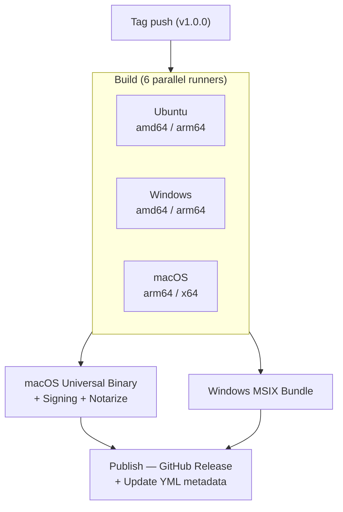

# CI/CD

Potassium provides reusable composite actions and ready-to-use GitHub Actions workflows for building, packaging, and publishing desktop applications across all platforms.

!!! tip "Use Potassium actions in your own project"

    All composite actions can be referenced directly from the Potassium repository — no need to copy them into your project:

    ```yaml
    - uses: kdroidFilter/Nucleus/.github/actions/setup-potassium@main
    ```

    Replace `@main` with a specific tag (e.g. `@v1.0.0`) to pin a stable version.

## Overview

A typical release pipeline has four stages:



## `setup-potassium` Action

The `setup-potassium` composite action (`.github/actions/setup-potassium`) sets up the complete build environment: JetBrains Runtime 25, packaging tools, Gradle, and Node.js — all cross-platform.

### Usage

```yaml
- uses: kdroidFilter/Nucleus/.github/actions/setup-potassium@main
  with:
    jbr-version: '25.0.2b329.66'
    packaging-tools: 'true'
    flatpak: 'true'
    snap: 'true'
    setup-gradle: 'true'
    setup-node: 'true'
```

### Inputs

| Input | Default | Description |
|-------|---------|-------------|
| `jbr-version` | `25.0.2b329.66` | JBR version (e.g. `25.0.2b329.66`) |
| `jbr-variant` | `jbrsdk` | JBR variant (`jbrsdk`, `jbrsdk_jcef`, etc.) |
| `jbr-download-url` | — | Override complete JBR download URL (bypasses version/variant) |
| `graalvm` | `false` | Use GraalVM (Liberica NIK) instead of JBR |
| `graalvm-java-version` | `25` | GraalVM Java version (when `graalvm` is `true`) |
| `packaging-tools` | `true` | Install xvfb, rpm, fakeroot, patchelf, libx11-dev, libdbus-1-dev (Linux only) |
| `flatpak` | `false` | Install Flatpak + Freedesktop SDK 24.08 (Linux only) |
| `snap` | `false` | Install Snapd + Snapcraft (Linux only) |
| `setup-gradle` | `true` | Setup Gradle via `gradle/actions/setup-gradle@v4` |
| `setup-node` | `true` | Setup Node.js (needed for electron-builder) |
| `node-version` | `20` | Node.js version when `setup-node` is `true` |

### Outputs

| Output | Description |
|--------|-------------|
| `java-home` | Path to the JBR installation |

### GraalVM Mode

When `graalvm: 'true'` is set, the action installs **BellSoft Liberica NIK** instead of JBR, plus platform-specific toolchains:

```yaml
- uses: kdroidFilter/Nucleus/.github/actions/setup-potassium@main
  with:
    graalvm: 'true'
    setup-gradle: 'true'
    setup-node: 'true'
```

This automatically:

- Installs **Liberica NIK 25** via `graalvm/setup-graalvm@v1`
- Selects **Xcode 26** on macOS
- Sets up **MSVC** on Windows via `ilammy/msvc-dev-cmd@v1`
- Skips JBR installation entirely

### What It Does

The action automatically:
- Downloads and installs **JBR 25** (or **Liberica NIK 25** in GraalVM mode) for the current platform and architecture
- Sets `JAVA_HOME` and adds the JDK to `PATH`
- Installs Linux packaging tools (`xvfb`, `rpm`, `fakeroot`, `patchelf`, `libx11-dev`, `libdbus-1-dev`) and starts Xvfb with `DISPLAY=:99`
- Installs Flatpak + Freedesktop SDK 24.08 (if enabled)
- Installs Snapd + Snapcraft (if enabled)
- Sets up Gradle caching via `gradle/actions/setup-gradle@v4`
- Sets up Node.js (if enabled)

## Release Build

Build native packages for all platforms on tag push.

### Build Matrix

```yaml
# .github/workflows/release.yaml
name: Release Desktop App (All Platforms)

on:
  push:
    tags: ['v*']
  workflow_dispatch:

permissions:
  contents: write

concurrency:
  group: release-${{ github.ref }}
  cancel-in-progress: false

jobs:
  build:
    name: Build (${{ matrix.os }} / ${{ matrix.arch }})
    runs-on: ${{ matrix.os }}
    timeout-minutes: 120
    strategy:
      fail-fast: false
      matrix:
        include:
          # Linux
          - os: ubuntu-latest
            arch: amd64
          - os: ubuntu-24.04-arm
            arch: arm64

          # Windows
          - os: windows-latest
            arch: amd64
          - os: windows-11-arm
            arch: arm64

          # macOS
          - os: macos-latest
            arch: arm64
          - os: macos-15-intel
            arch: amd64

    env:
      GH_TOKEN: ${{ secrets.GITHUB_TOKEN }}
      GITHUB_TOKEN: ${{ secrets.GITHUB_TOKEN }}
      RELEASE_VERSION: ${{ github.ref_name }}

    steps:
      - uses: actions/checkout@v4
        with:
          fetch-depth: 0

      - name: Normalize version for manual runs
        if: github.event_name == 'workflow_dispatch'
        shell: bash
        run: |
          set -euo pipefail
          tag="$(git describe --tags --abbrev=0)"
          echo "RELEASE_VERSION=$tag" >> "$GITHUB_ENV"

      - name: Setup Potassium
        uses: kdroidFilter/Nucleus/.github/actions/setup-potassium@main
        with:
          jbr-version: '25.0.2b329.66'
          packaging-tools: 'true'
          flatpak: 'true'
          snap: 'true'
          setup-gradle: 'true'
          setup-node: 'true'

      - name: Build packages
        shell: bash
        run: ./gradlew packageReleaseDistributionForCurrentOS --stacktrace --no-daemon

      - uses: actions/upload-artifact@v4
        with:
          name: release-assets-${{ runner.os }}-${{ matrix.arch }}
          path: |
            build/potassium/binaries/**/*.dmg
            build/potassium/binaries/**/*.pkg
            build/potassium/binaries/**/*.exe
            build/potassium/binaries/**/*.msi
            build/potassium/binaries/**/*.appx
            build/potassium/binaries/**/*.deb
            build/potassium/binaries/**/*.rpm
            build/potassium/binaries/**/*.AppImage
            build/potassium/binaries/**/*.snap
            build/potassium/binaries/**/*.flatpak
            build/potassium/binaries/**/*.zip
            build/potassium/binaries/**/*.tar
            build/potassium/binaries/**/*.7z
            build/potassium/binaries/**/*.blockmap
            build/potassium/binaries/**/signing-metadata.json
            build/potassium/binaries/**/packaging-metadata.json
            !build/potassium/binaries/**/app/**
            !build/potassium/binaries/**/runtime/**
          if-no-files-found: error
```

### Custom JBR URL (per-matrix entry)

You can override the JBR download URL for specific matrix entries. This is useful for custom JBR builds (e.g. with RTL patches):

```yaml
matrix:
  include:
    - os: macos-latest
      arch: arm64
      jbr-download-url: 'https://example.com/jbr-25-macos-aarch64-custom.tar.gz'
    - os: macos-15-intel
      arch: amd64
      jbr-download-url: 'https://example.com/jbr-25-macos-x64-custom.tar.gz'

steps:
  - uses: kdroidFilter/Nucleus/.github/actions/setup-potassium@main
    with:
      jbr-version: '25.0.2b329.66'
      jbr-download-url: ${{ matrix.jbr-download-url || '' }}
```

### Version from Tag

The `RELEASE_VERSION` environment variable is set from the Git tag. In your `build.gradle.kts`:

```kotlin
val releaseVersion = System.getenv("RELEASE_VERSION")
    ?.removePrefix("v")
    ?.takeIf { it.isNotBlank() }
    ?: "1.0.0"

potassium {
    packageVersion = releaseVersion
}
```

## Universal macOS Binaries

Merge arm64 and x64 builds into a universal (fat) binary using `lipo`, then optionally sign and notarize. Potassium includes reusable composite actions (`setup-macos-signing` and `build-macos-universal`):

```yaml
  universal-macos:
    name: Universal macOS Binary
    needs: [build]
    if: needs.build.result == 'success'
    runs-on: macos-latest
    timeout-minutes: 45

    steps:
      - uses: actions/checkout@v4

      - uses: actions/setup-node@v4
        with:
          node-version: '20'

      # Setup signing (conditional — skipped if secrets not configured)
      - name: Setup macOS signing
        id: signing
        if: ${{ secrets.MAC_CERTIFICATES_P12 != '' }}
        uses: kdroidFilter/Nucleus/.github/actions/setup-macos-signing@main
        with:
          certificate-base64: ${{ secrets.MAC_CERTIFICATES_P12 }}
          certificate-password: ${{ secrets.MAC_CERTIFICATES_PASSWORD }}

      # Decode provisioning profiles for App Store PKG
      - name: Decode provisioning profiles
        if: ${{ secrets.MAC_PROVISIONING_PROFILE != '' }}
        shell: bash
        run: |
          echo "${{ secrets.MAC_PROVISIONING_PROFILE }}" | base64 -d > "$RUNNER_TEMP/embedded.provisionprofile"
          echo "PROVISIONING=$RUNNER_TEMP/embedded.provisionprofile" >> "$GITHUB_ENV"
          if [[ -n "${{ secrets.MAC_RUNTIME_PROVISIONING_PROFILE }}" ]]; then
            echo "${{ secrets.MAC_RUNTIME_PROVISIONING_PROFILE }}" | base64 -d > "$RUNNER_TEMP/runtime-embedded.provisionprofile"
            echo "RUNTIME_PROVISIONING=$RUNNER_TEMP/runtime-embedded.provisionprofile" >> "$GITHUB_ENV"
          fi

      - uses: actions/download-artifact@v4
        with:
          name: release-assets-macOS-arm64
          path: artifacts/release-assets-macOS-arm64

      - uses: actions/download-artifact@v4
        with:
          name: release-assets-macOS-amd64
          path: artifacts/release-assets-macOS-amd64

      - name: Build universal binary
        uses: kdroidFilter/Nucleus/.github/actions/build-macos-universal@main
        with:
          arm64-path: artifacts/release-assets-macOS-arm64
          x64-path: artifacts/release-assets-macOS-amd64
          output-path: artifacts/release-assets-macOS-universal
          signing-identity: ${{ secrets.MAC_DEVELOPER_ID_APPLICATION }}
          app-store-identity: ${{ secrets.MAC_APP_STORE_APPLICATION }}
          installer-identity: ${{ secrets.MAC_APP_STORE_INSTALLER }}
          keychain-path: ${{ steps.signing.outputs.keychain-path }}
          entitlements-file: example/packaging/macos/entitlements.plist
          runtime-entitlements-file: example/packaging/macos/runtime-entitlements.plist
          provisioning-profile: ${{ env.PROVISIONING }}
          runtime-provisioning-profile: ${{ env.RUNTIME_PROVISIONING }}

      # Notarize DMG and ZIP (conditional)
      - name: Notarize DMG
        if: ${{ secrets.MAC_NOTARIZATION_APPLE_ID != '' }}
        run: |
          DMG="$(find artifacts/release-assets-macOS-universal -name '*.dmg' -type f | head -1)"
          xcrun notarytool submit "$DMG" \
            --apple-id "${{ secrets.MAC_NOTARIZATION_APPLE_ID }}" \
            --password "${{ secrets.MAC_NOTARIZATION_PASSWORD }}" \
            --team-id "${{ secrets.MAC_NOTARIZATION_TEAM_ID }}" --wait
          xcrun stapler staple "$DMG"

      - name: Cleanup keychain
        if: always() && steps.signing.outputs.keychain-path != ''
        run: security delete-keychain "${{ steps.signing.outputs.keychain-path }}" || true

      - uses: actions/upload-artifact@v4
        with:
          name: release-assets-macOS-universal
          path: artifacts/release-assets-macOS-universal
          if-no-files-found: error
```

### `build-macos-universal` Inputs

| Input | Required | Description |
|-------|----------|-------------|
| `arm64-path` | Yes | Directory with arm64 artifacts |
| `x64-path` | Yes | Directory with x64 artifacts |
| `output-path` | No | Output directory (default: `universal-output`) |
| `signing-identity` | No | Developer ID Application identity for DMG/ZIP signing |
| `app-store-identity` | No | 3rd Party Mac Developer Application identity for App Store PKG |
| `installer-identity` | No | 3rd Party Mac Developer Installer identity for PKG signing |
| `keychain-path` | No | Path to keychain from `setup-macos-signing` |
| `entitlements-file` | No | Path to `entitlements.plist` |
| `runtime-entitlements-file` | No | Path to `runtime-entitlements.plist` |
| `provisioning-profile` | No | Path to `embedded.provisionprofile` for sandboxed app |
| `runtime-provisioning-profile` | No | Path to runtime provisioning profile |

## Windows MSIX Bundle

Combine amd64 and arm64 `.appx` files into a single `.msixbundle`. Potassium includes a reusable composite action (`build-windows-appxbundle`):

```yaml
  bundle-windows:
    name: Windows APPX Bundle
    needs: [build]
    if: needs.build.result == 'success'
    runs-on: windows-latest
    timeout-minutes: 15

    steps:
      - uses: actions/download-artifact@v4
        with:
          name: release-assets-Windows-amd64
          path: artifacts/release-assets-Windows-amd64

      - uses: actions/download-artifact@v4
        with:
          name: release-assets-Windows-arm64
          path: artifacts/release-assets-Windows-arm64

      - name: Build APPX Bundle
        uses: kdroidFilter/Nucleus/.github/actions/build-windows-appxbundle@main
        with:
          amd64-path: artifacts/release-assets-Windows-amd64
          arm64-path: artifacts/release-assets-Windows-arm64
          output-path: artifacts/release-assets-Windows-bundle
          certificate-password: ${{ secrets.WIN_CSC_KEY_PASSWORD }}

      - uses: actions/upload-artifact@v4
        with:
          name: release-assets-Windows-bundle
          path: artifacts/release-assets-Windows-bundle
          if-no-files-found: error
```

## Publish to GitHub Releases

After all builds complete, create a GitHub Release with all artifacts and update YML files. Potassium includes composite actions for both (`generate-update-yml` and `publish-release`):

```yaml
  publish:
    name: Publish Release
    needs: [build, universal-macos, bundle-windows]
    if: ${{ !cancelled() && needs.build.result == 'success' }}
    runs-on: ubuntu-latest
    timeout-minutes: 30

    env:
      GH_TOKEN: ${{ secrets.GITHUB_TOKEN }}
      GITHUB_TOKEN: ${{ secrets.GITHUB_TOKEN }}

    steps:
      - uses: actions/download-artifact@v4
        with:
          path: artifacts
          pattern: release-assets-*

      - name: Determine version and channel
        shell: bash
        run: |
          set -euo pipefail
          TAG="${GITHUB_REF_NAME}"
          VERSION="${TAG#v}"
          echo "TAG=$TAG" >> "$GITHUB_ENV"
          echo "VERSION=$VERSION" >> "$GITHUB_ENV"

          if [[ "$VERSION" == *"-alpha"* ]]; then
            echo "CHANNEL=alpha" >> "$GITHUB_ENV"
            echo "RELEASE_TYPE=prerelease" >> "$GITHUB_ENV"
          elif [[ "$VERSION" == *"-beta"* ]]; then
            echo "CHANNEL=beta" >> "$GITHUB_ENV"
            echo "RELEASE_TYPE=prerelease" >> "$GITHUB_ENV"
          else
            echo "CHANNEL=latest" >> "$GITHUB_ENV"
            echo "RELEASE_TYPE=release" >> "$GITHUB_ENV"
          fi

      - name: Generate update YML files
        uses: kdroidFilter/Nucleus/.github/actions/generate-update-yml@main
        with:
          artifacts-path: artifacts
          version: ${{ env.VERSION }}
          channel: ${{ env.CHANNEL }}

      - name: Publish release
        uses: kdroidFilter/Nucleus/.github/actions/publish-release@main
        with:
          artifacts-path: artifacts
          tag: ${{ env.TAG }}
          release-type: ${{ env.RELEASE_TYPE }}
```

## Required Secrets Summary

| Secret | Used By | Description |
|--------|---------|-------------|
| `GITHUB_TOKEN` | Release workflow | Auto-provided by GitHub Actions |
| `WIN_CSC_LINK` | Build (Windows) | Base64-encoded `.pfx` certificate |
| `WIN_CSC_KEY_PASSWORD` | Build (Windows) | Certificate password |
| `MAC_CERTIFICATES_P12` | Universal macOS | Base64-encoded `.p12` with all signing certs |
| `MAC_CERTIFICATES_PASSWORD` | Universal macOS | Password for the `.p12` file |
| `MAC_DEVELOPER_ID_APPLICATION` | Universal macOS | Developer ID Application identity (DMG/ZIP) |
| `MAC_DEVELOPER_ID_INSTALLER` | Universal macOS | Developer ID Installer identity (optional) |
| `MAC_APP_STORE_APPLICATION` | Universal macOS | 3rd Party Mac Developer Application identity (PKG) |
| `MAC_APP_STORE_INSTALLER` | Universal macOS | 3rd Party Mac Developer Installer identity (PKG) |
| `MAC_PROVISIONING_PROFILE` | Universal macOS | Base64-encoded `embedded.provisionprofile` |
| `MAC_RUNTIME_PROVISIONING_PROFILE` | Universal macOS | Base64-encoded runtime provisioning profile |
| `MAC_NOTARIZATION_APPLE_ID` | Universal macOS | Apple ID for notarization |
| `MAC_NOTARIZATION_PASSWORD` | Universal macOS | App-specific password for notarization |
| `MAC_NOTARIZATION_TEAM_ID` | Universal macOS | Apple Team ID for notarization |

## Composite Actions Reference

Potassium provides reusable composite actions that you can reference directly in your workflows using `kdroidFilter/Nucleus/.github/actions/<action>@main`:

| Action | Usage | Description |
|--------|-------|-------------|
| `setup-potassium` | `kdroidFilter/Nucleus/.github/actions/setup-potassium@main` | Setup JBR 25, packaging tools, Gradle, Node.js |
| `setup-macos-signing` | `kdroidFilter/Nucleus/.github/actions/setup-macos-signing@main` | Create temporary keychain and import signing certificates |
| `build-macos-universal` | `kdroidFilter/Nucleus/.github/actions/build-macos-universal@main` | Merge arm64 + x64 into universal binary via `lipo`, sign, and package |
| `build-windows-appxbundle` | `kdroidFilter/Nucleus/.github/actions/build-windows-appxbundle@main` | Combine amd64 + arm64 `.appx` into `.msixbundle` |
| `generate-update-yml` | `kdroidFilter/Nucleus/.github/actions/generate-update-yml@main` | Generate `latest-*.yml` / `beta-*.yml` / `alpha-*.yml` metadata |
| `publish-release` | `kdroidFilter/Nucleus/.github/actions/publish-release@main` | Create GitHub Release with all artifacts |

## GraalVM Native Image Release

Build and publish GraalVM native packages (DEB, DMG, NSIS) on tag push. Uses `setup-potassium` with `graalvm: 'true'` and the `packageGraalvm<Format>` tasks:

```yaml
name: Release GraalVM Native Image

on:
  push:
    tags: ['v*']

permissions:
  contents: write

jobs:
  build:
    name: GraalVM - ${{ matrix.name }}
    runs-on: ${{ matrix.os }}
    timeout-minutes: 60
    strategy:
      fail-fast: false
      matrix:
        include:
          - name: Linux x64
            os: ubuntu-latest
            arch: amd64
          - name: Linux ARM64
            os: ubuntu-24.04-arm
            arch: arm64
          - name: macOS ARM64
            os: macos-latest
            arch: arm64
          - name: macOS Intel
            os: macos-15-intel
            arch: amd64
          - name: Windows x64
            os: windows-latest
            arch: amd64

    steps:
      - uses: actions/checkout@v4

      - name: Setup Potassium (GraalVM)
        uses: kdroidFilter/Nucleus/.github/actions/setup-potassium@main
        with:
          graalvm: 'true'
          setup-gradle: 'true'
          setup-node: 'true'

      - name: Build GraalVM native packages
        shell: bash
        run: |
          if [ "$RUNNER_OS" = "Linux" ]; then
            xvfb-run ./gradlew :myapp:packageGraalvmLinux \
              -PnativeMarch=compatibility --no-daemon
          elif [ "$RUNNER_OS" = "macOS" ]; then
            ./gradlew :myapp:packageGraalvmMacOS \
              -PnativeMarch=compatibility --no-daemon
          elif [ "$RUNNER_OS" = "Windows" ]; then
            ./gradlew :myapp:packageGraalvmWindows \
              -PnativeMarch=compatibility --no-daemon
          fi

      - uses: actions/upload-artifact@v4
        with:
          name: graalvm-${{ runner.os }}-${{ matrix.arch }}
          path: myapp/build/potassium/binaries/**/graalvm-*/**
          if-no-files-found: error
```

### GraalVM Packaging Tasks

| Task | Format | Platform |
|------|--------|----------|
| `packageGraalvmLinux` | `.deb` | Linux |
| `packageGraalvmMacOS` | `.dmg` | macOS |
| `packageGraalvmWindows` | `.exe` (NSIS installer) | Windows |
| `packageGraalvmNative` | Raw binary + libraries | All (no installer) |

These tasks first compile the native image via `packageGraalvmNative`, then package it using electron-builder into the target format. Node.js is required (`setup-node: 'true'`).

## Tips

- **JBR 25 required**: Use `setup-potassium` for all packaging builds — it installs JBR 25 automatically
- **Pin a version**: Use a tag (e.g. `@v1.0.0`) instead of `@main` for reproducible builds
- **Concurrency**: Use `concurrency` to prevent parallel releases
- **fail-fast: false**: Continue building other platforms if one fails
- **Timeout**: Set generous timeouts (120min) for Flatpak/Snap builds
- **Caching**: `setup-potassium` enables Gradle caching automatically via `gradle/actions/setup-gradle@v4`
- **No checkout needed**: When using actions from `kdroidFilter/Nucleus`, GitHub fetches them automatically — no need to checkout the Potassium repository
- **workflow_dispatch**: Add it as a trigger to allow re-running a release manually
