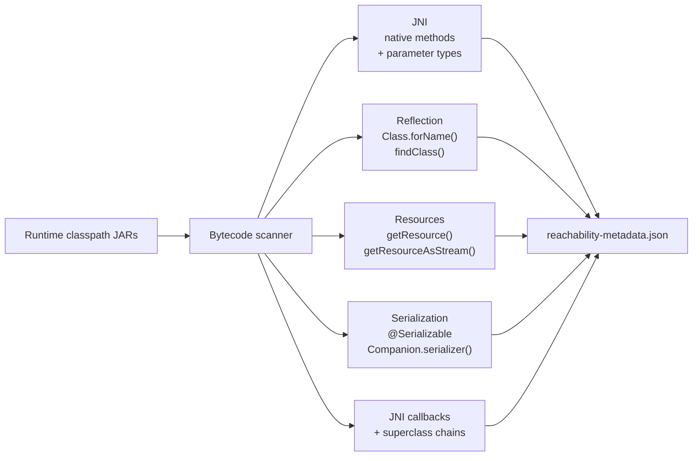
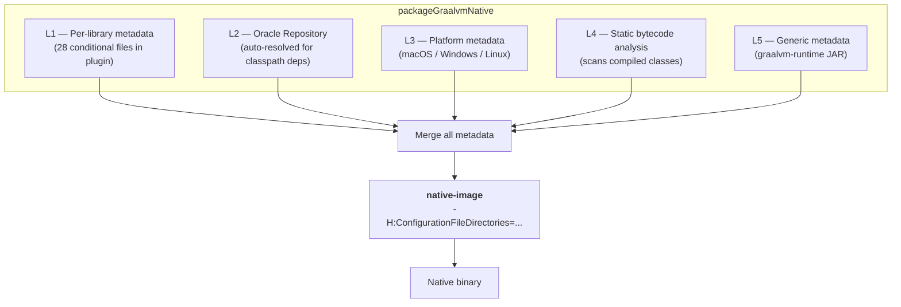

# Automatic Metadata Resolution

The goal of Nucleus is to make GraalVM native-image compilation **as transparent as possible**. In most cases, you should be able to run `packageGraalvmNative` and get a working binary without writing a single line of reflection configuration. To achieve this, Nucleus combines five complementary metadata sources that are resolved and merged automatically at build time.

## Level 1 — Per-library conditional metadata

The Nucleus Gradle plugin ships **28 per-library metadata files** covering Compose UI, Skiko, ktor, kotlinx.serialization, SQLite, Coil, JNA, FileKit, and many others. Each file declares a `matchPackages` condition — the metadata is only included if the corresponding library is actually present on your runtime classpath.

This means libraries like ktor or SQLite JDBC **just work** in native image without any manual configuration.

## Level 2 — Oracle Reachability Metadata Repository

Nucleus automatically downloads the [Oracle GraalVM Reachability Metadata Repository](https://github.com/oracle/graalvm-reachability-metadata) and resolves metadata for all dependencies on your runtime classpath. This covers libraries that are not yet covered by Nucleus's own L1 metadata — SLF4J, Logback, and many others. The resolved metadata directories are passed to `native-image` via `-H:ConfigurationFileDirectories=`.

This is enabled by default. To customize:

```kotlin
graalvm {
    metadataRepository {
        enabled = true                    // disable with false
        version = "0.10.6"               // override repository version
        excludedModules.add("group:artifact")  // skip specific dependencies
        moduleToConfigVersion.put(        // pin a specific metadata version
            "io.ktor:ktor-client-core",
            "3.0.0",
        )
    }
}
```

## Level 3 — Platform-specific metadata

The Nucleus Gradle plugin ships pre-built platform-specific metadata for macOS, Windows, and Linux. These cover platform-specific AWT implementations (`sun.awt.windows.*`, `sun.lwawt.macosx.*`, `sun.awt.X11.*`), Java2D pipelines, font managers, and security providers. The plugin writes the correct platform metadata to the build directory at compile time — **no per-platform configuration needed in your build script**.

## Level 4 — Static bytecode analysis

Nucleus includes a **static bytecode analyzer** that scans all compiled classes on your runtime classpath at build time and automatically detects reflection, JNI, and resource requirements — without running the application. The analyzer detects:

- **Native methods** and their parameter/return types (JNI metadata)
- **`Class.forName()`** and **`MethodHandles.Lookup.findClass()`** calls (reflection metadata)
- **`getResource()` / `getResourceAsStream()`** calls (resource metadata)
- **JNI callback parameters** — classes passed to native code that call back into Java
- **JNI superclass chains** — parent classes needed for field access from native code
- **`@Serializable` classes** — automatically emits `Companion.serializer()` reflection entries

This analysis runs transparently as part of the build (the `analyzeGraalvmStaticMetadata` task) and its output is passed to `native-image` alongside the other metadata levels.



## Level 5 — Generic cross-platform metadata

The `graalvm-runtime` module ships a `reachability-metadata.json` inside its JAR that covers all cross-platform reflection entries: Compose Desktop, AWT/Swing, Skiko, security providers, font managers, and more (~300+ types). This metadata is **automatically picked up** by native-image from the classpath — no configuration needed.

## How it all fits together

When you run `packageGraalvmNative`, Nucleus automatically resolves all five metadata levels and passes them to `native-image`:



All of this happens transparently — no manual steps required. The result is that **most applications compile and run as native images without any manual reflection configuration**.

## The tracing agent — a final safety net

Even with five levels of automatic metadata, there can be edge cases that static analysis cannot catch: reflection driven by runtime values, dynamically loaded classes, or unusual library patterns. The tracing agent (`runWithNativeAgent`) remains available as a **final verification step**:

```bash
./gradlew runWithNativeAgent
```

During the tracing run, navigate through every screen and feature of your application. The agent records all reflection, JNI, resource, and proxy accesses and **merges** the results into your existing configuration. Entries already covered by the five metadata levels are **automatically deduplicated** — the agent output stays minimal.

In many cases, the agent will find nothing new — the automatic metadata already covers everything. But running it once before release is a good safety net, especially for applications with complex library dependencies.

## Cleaning up manual metadata

If you accumulated manual entries in your `reachability-metadata.json` that are now covered by the automatic metadata levels, you can clean them up:

```bash
./gradlew cleanupGraalvmMetadata
```

This task compares your manual entries against the combined baseline (L1 + L2 + L3 + L4) and removes any that are already covered. It reports what was removed and what remains, so you can verify the cleanup is safe.
