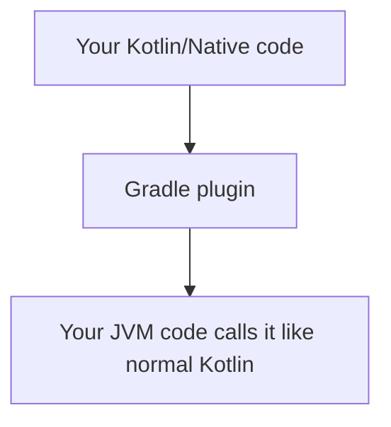

# Nucleus Native Access

Every now and then, no runtime library covers your exact native API need. Potassium handles the common cases with JNI — but when you need something specific (a platform API, a custom algorithm, a C library), the usual path involves writing JNI glue in C, building a `.so`/`.dylib`/`.dll`, bundling it, and wiring it up from Kotlin. That's a lot of friction for what should be a simple call.

**Nucleus Native Access** removes that friction. Write your native logic in **Kotlin/Native**, and the plugin generates the FFM bridge automatically. No C, no build scripts, no manual JNI plumbing — just Kotlin on both sides.

!!! note "FFM, not JNI"
    Potassium's built-in runtime libraries (decorated windows, dark mode, notifications…) use **JNI** for broad compatibility. Nucleus Native Access uses the **Foreign Function & Memory (FFM) API** (JEP 454, stable since JDK 22). Both are valid approaches, but FFM lets you write the native side in pure Kotlin rather than C.

## How It Works



The plugin:

1. Analyzes sources via **Kotlin PSI**
2. Generates `@CName` bridge functions (native side)
3. Generates FFM `MethodHandle` proxies (JVM side)
4. Compiles to `.so` / `.dylib` / `.dll`
5. Bundles into JAR under `kne/native/{os}-{arch}/`

The generated JVM proxies have **the exact same API** as your native classes — same names, same types, same method signatures. No wrapper types, no casting, no boilerplate.

## Setup

!!! note "Separate versioning"
    Nucleus Native Access is versioned independently from Potassium. Check the latest version on the [NucleusNativeAccess repository](https://github.com/kdroidFilter/NucleusNativeAccess).

Add the plugin to your Kotlin Multiplatform module:

```kotlin
// build.gradle.kts
plugins {
    kotlin("multiplatform")
    id("io.github.kdroidfilter.nucleusnativeaccess") version "<version>" // see github.com/kdroidFilter/NucleusNativeAccess
}

kotlin {
    jvmToolchain(25) // FFM requires JDK 22+; JDK 25 recommended

    macosArm64()     // or macosX64(), linuxX64(), mingwX64()
    jvm()
}

kotlinNativeExport {
    nativeLibName = "mylib"
    nativePackage = "com.example.mylib"
}
```

That's the entire configuration. The plugin handles compilation, bundling, and loading automatically.

!!! warning "JDK requirement"
    FFM is stable from **JDK 22+**. JDK 25 is recommended. When running tests or the app, the JVM arg `--enable-native-access=ALL-UNNAMED` is required — the plugin adds it automatically for tests.

### Using with Compose Desktop

The Compose compiler plugin doesn't support arbitrary Kotlin/Native targets (e.g. `linuxX64`, `mingwX64`) used for FFM bridges. **Put your native code in a separate Gradle module** without the Compose compiler plugin:

```
my-app/
├── native/              ← Kotlin/Native + nucleusnativeaccess (no Compose)
│   └── build.gradle.kts
├── app/                 ← Compose Desktop + Potassium, depends on :native
│   └── build.gradle.kts
└── settings.gradle.kts
```

**`:native/build.gradle.kts`**:

```kotlin
plugins {
    kotlin("multiplatform")
    id("io.github.kdroidfilter.nucleusnativeaccess") version "<version>"
}

kotlin {
    jvmToolchain(25)
    linuxX64()  // or macosArm64(), mingwX64()
    jvm()
}

kotlinNativeExport {
    nativeLibName = "mylib"
    nativePackage = "com.example.mylib"
}
```

**`:app/build.gradle.kts`**:

```kotlin
plugins {
    kotlin("multiplatform")
    id("org.jetbrains.compose")
    id("org.jetbrains.kotlin.plugin.compose")
    id("com.seanproctor.potassium") version "1.15.11"
}

kotlin {
    jvmToolchain(25)
    jvm()

    sourceSets {
        val jvmMain by getting {
            dependencies {
                implementation(compose.desktop.currentOs)
                implementation(project(":native"))
            }
        }
    }
}

potassium {
    mainClass = "com.example.MainKt"
    jvmArgs += listOf("--enable-native-access=ALL-UNNAMED")
}
```

## GraalVM Native Image

Nucleus Native Access includes full GraalVM metadata generation:

- `reflect-config.json` for all generated proxy classes
- `resource-config.json` for bundled native libraries
- `reachability-metadata.json` for FFM descriptors

No manual configuration needed — the generated metadata is picked up automatically by the [Potassium GraalVM plugin](../graalvm/index.md).

## Repository

Nucleus Native Access is maintained in a separate repository with its own release cycle:

[**kdroidFilter/NucleusNativeAccess**](https://github.com/kdroidFilter/NucleusNativeAccess) — plugin source, examples, full documentation, and latest releases.

The plugin ID is `io.github.kdroidfilter.nucleusnativeaccess`.

## Next steps

- [Supported Types](types.md) — Full type mapping reference, declarations, and current limitations
- [Usage & Patterns](usage.md) — Real-world examples, coroutines, flows, object lifecycle
